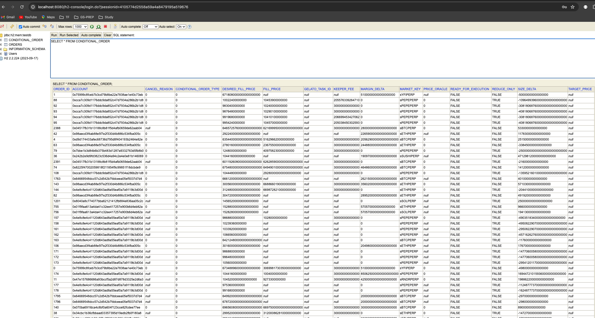
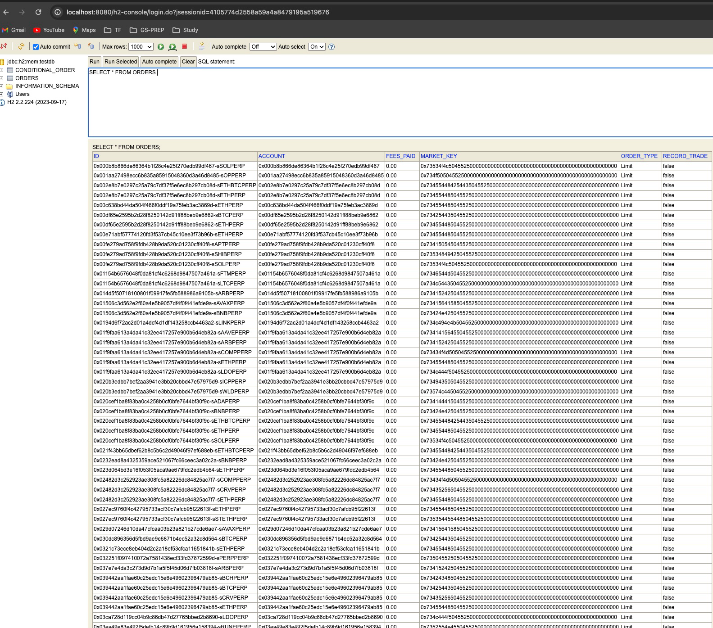
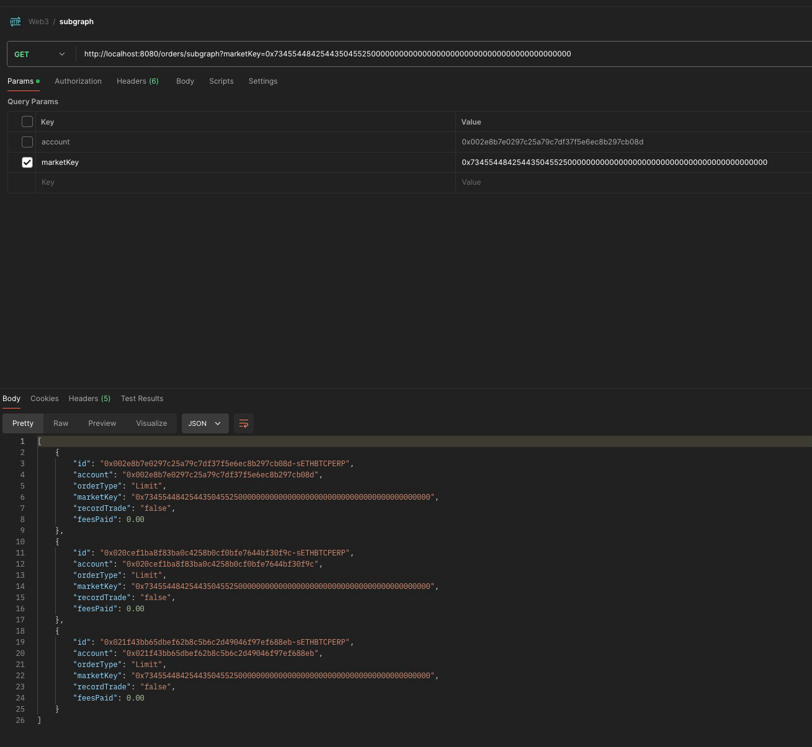

# About the Project 

## Basic Implementation 

- This project is an implementation to read the Limit orders from Op Mainnet using Subgraph Implementation as well as read the conditional orders from the OP Mainnet using the Blocks
- Adding the limit orders to H2 database for now (Default)
- (The implementation for postgres is also similar but for that the assessor needs to setup the postgres DB hence I am using H2 database for example However in application.yaml I have added the properties for Postgres connection we can create similar DB in local or can provide the connection details in the commented part shown in the properties and then comment the H2 related settings as shown below)
- 
- 
- The data can be seen on the H2 database console using below steps
    1. after starting the application on Port 8080 go to the URL
    2. http://localhost:8080/h2-console/login.jsp
    3. login using password as password
    4. then you can see
        1. 
        2. 
        3. 

## Subgraph Implementation 
- The endpoint to read orders that are fetched from subgraph on the basis of Market key and account as filter is  http://localhost:8080/orders/subgraph
  1. When No filter is used 
  2. When account filter is applied 
  3. When Market filter is applied 
  4. When both account and marketKey filters are applied 


## Chain Implementation
- The endpoint to read orders that are fetched from subgraph on the basis of Market key and account as filter is  http://localhost:8080/orders/chain
    1. When No filter is used 
    2. When account filter is applied 
    3. When Market filter is applied 
    4. When both account and marketKey filters are applied 


## Questions to answer in readme 

1. Write out or write pseudocode on how you would handle order execution to a blockchain like Optimism. Please be specific about the transaction queue, nonce ordering, and handling of gas fees.
2. Eventually checking all orders every block becomes unsustainable as the number of orders placed grows linearly. How would you optimize validity checking that way orders can be executed efficiently? - implement price filter

## Answers 

### To ensures efficient handling of transactions, maintains proper ordering, and optimizes the validity checking process.

- Transaction Queue Management: Use a priority queue to manage transactions based on gas price and nonce.
- Nonce Ordering: Track nonces for each sender to ensure proper ordering.
- Gas Fees Handling: Validate if the sender has enough balance to cover gas fees.
- Validity Optimization: Implement a price filter using an order book with efficient range queries to optimize matching and execution of orders.

### Pseudocode 

1.1 Transaction class 
```java

import java.math.BigInteger;

@Data
public class Transaction implements Comparable<Transaction> {
    private String sender;
    private int nonce;
    private BigInteger gasPrice;
    private BigInteger gasLimit;
    private OrderDetails orderDetails;

    public Transaction(String sender, int nonce, BigInteger gasPrice, BigInteger gasLimit, OrderDetails orderDetails) {
        this.sender = sender;
        this.nonce = nonce;
        this.gasPrice = gasPrice;
        this.gasLimit = gasLimit;
        this.orderDetails = orderDetails;
    }

   

    @Override
    public int compareTo(Transaction other) {
        int gasPriceComparison = this.gasPrice.compareTo(other.gasPrice);
        if (gasPriceComparison != 0) {
            return gasPriceComparison;
        }
        return Integer.compare(this.nonce, other.nonce);
    }
}

```
1.2 Order class

```java

import jdk.jfr.DataAmount;

@Data
@AllArgsConstructor
@NoArgsConstructor
public class OrderDetails {
    private String side; // "buy" or "sell"
    private BigInteger price;
    private BigInteger amount;

    
}

```
2. Handling Gas Fees (Validity Check:)

```java

import java.math.BigInteger;

public class BlockchainUtils {
    public static BigInteger getBalance(String sender) {
        // Query the blockchain for the sender's balance
        return BigInteger.ZERO;
    }

    public static int getLatestNonce(String sender) {
        // Query the blockchain for the latest nonce of the sender
        return 0;
    }

    public static boolean isValid(Transaction transaction) {
        BigInteger balance = getBalance(transaction.getSender());
        BigInteger totalGasCost = transaction.getGasPrice().multiply(transaction.getGasLimit());
        return balance.compareTo(totalGasCost) >= 0;
    }

    public static void executeTransaction(Transaction transaction) {
        // Interact with the blockchain to execute the transaction
    }
}

```
3. Optimizing Validity Checking (Order Book with Price Filter:)
```java

import java.math.BigInteger;
import java.util.SortedMap;
import java.util.TreeMap;

public class OrderBook {
    private SortedMap<BigInteger, List<OrderDetails>> buyOrders = new TreeMap<>(Collections.reverseOrder());
    private SortedMap<BigInteger, List<OrderDetails>> sellOrders = new TreeMap<>();

    public void addOrder(OrderDetails order) {
        if (order.getSide().equals("buy")) {
            buyOrders.computeIfAbsent(order.getPrice(), k -> new ArrayList<>()).add(order);
        } else if (order.getSide().equals("sell")) {
            sellOrders.computeIfAbsent(order.getPrice(), k -> new ArrayList<>()).add(order);
        }
    }

    public void matchOrders() {
        while (!buyOrders.isEmpty() && !sellOrders.isEmpty()) {
            BigInteger highestBuyPrice = buyOrders.firstKey();
            BigInteger lowestSellPrice = sellOrders.firstKey();

            if (highestBuyPrice.compareTo(lowestSellPrice) >= 0) {
                OrderDetails buyOrder = buyOrders.get(highestBuyPrice).remove(0);
                OrderDetails sellOrder = sellOrders.get(lowestSellPrice).remove(0);

                if (buyOrders.get(highestBuyPrice).isEmpty()) {
                    buyOrders.remove(highestBuyPrice);
                }
                if (sellOrders.get(lowestSellPrice).isEmpty()) {
                    sellOrders.remove(lowestSellPrice);
                }

                executeTrade(buyOrder, sellOrder);
            } else {
                break;
            }
        }
    }

    private void executeTrade(OrderDetails buyOrder, OrderDetails sellOrder) {
        // Implement the trade execution logic
    }
}

```
4. Integrating Price Filter into Transaction Processing (Transaction Queue Management:)
```java

import java.math.BigInteger;
import java.util.*;

public class TransactionProcessor {
    private PriorityQueue<Transaction> transactionQueue = new PriorityQueue<>();
    private Map<String, Integer> nonceTracker = new HashMap<>();
    private OrderBook orderBook = new OrderBook();

    public void addTransaction(String sender, BigInteger gasPrice, BigInteger gasLimit, OrderDetails orderDetails) {
        if (!nonceTracker.containsKey(sender)) {
            nonceTracker.put(sender, BlockchainUtils.getLatestNonce(sender));
        }

        int nonce = nonceTracker.get(sender);
        Transaction transaction = new Transaction(sender, nonce, gasPrice, gasLimit, orderDetails);
        transactionQueue.add(transaction);
        nonceTracker.put(sender, nonce + 1);
    }

    public void processTransactions() {
        while (!transactionQueue.isEmpty()) {
            Transaction transaction = transactionQueue.poll();
            if (BlockchainUtils.isValid(transaction)) {
                orderBook.addOrder(transaction.getOrderDetails());
            }
        }
        orderBook.matchOrders();
    }
}

```