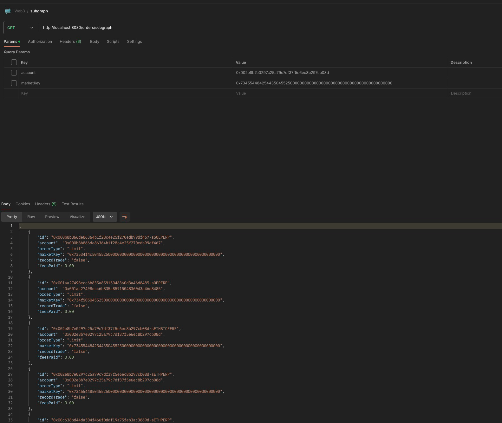
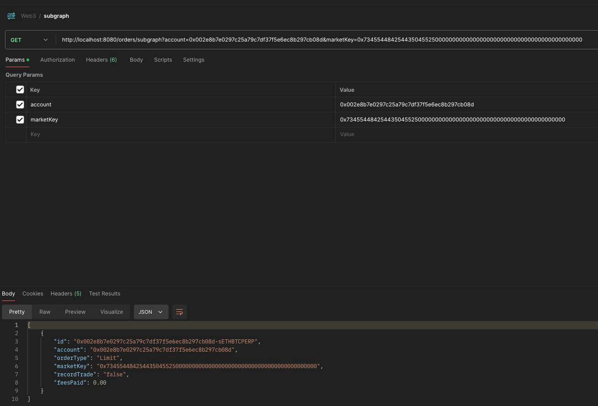

# About the Project 

## Basic Implementation 

- This project is a raw implementation to read the Limit orders from Op Mainnet using Subgraph Implementation 
- Adding the limit orders to H2 database for now (later will shift to Postgres)
- There is a endpoint provided to filter the orders on the basis of Market key and account 
- The data can be seen on the H2 database console using below steps
    1. after starting the application on Port 8080 go to the URL 
  2. http://localhost:8080/h2-console/login.jsp
  3. login using password as password 
  4. then you can see
     1. 
     2. 
     3. 
  
- Attached are the screenshots of a basic test done using postman and the
  1. When No filter is used 
  2. When account filter is applied 
  3. When Market filter is applied 
  4. When both account and marketKey filters are applied 